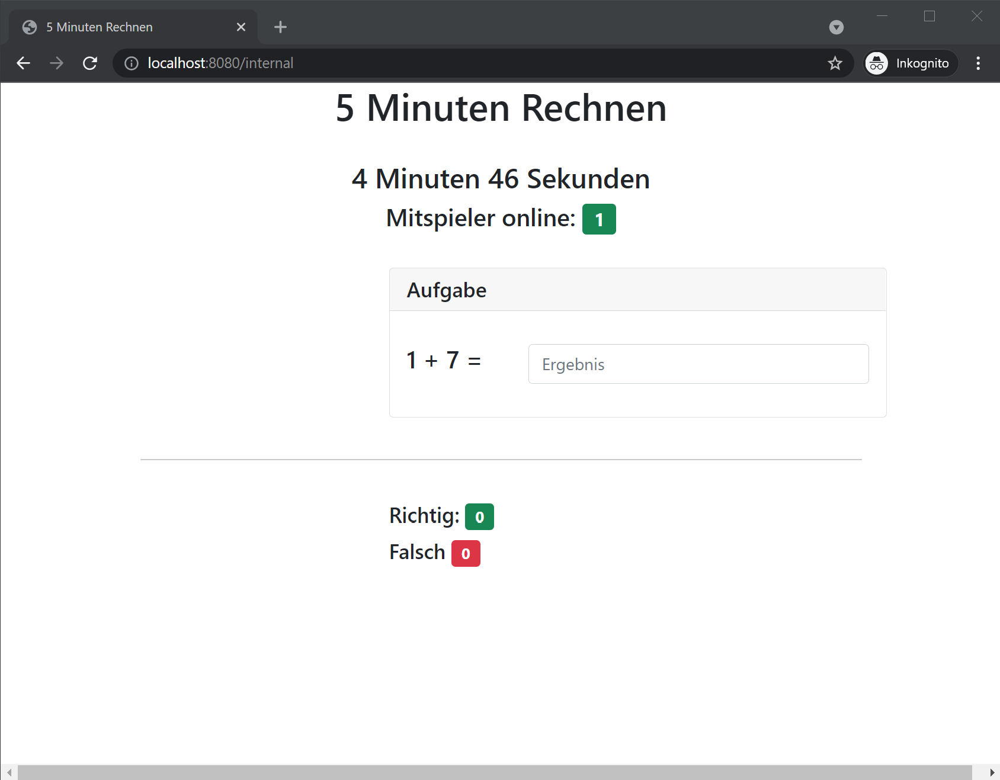

# 5minutes

Simple MMOG Game for practicing calculation.
Everyone can join and will get the same set of equations to solve in 5 minutes.

This is extremely basic and barely shows the idea.



## Running

```bash
 go run src/main.go src/hub.go src/task.go src/client.go
```

Then navigate to `localhost:8080` and give yourself a nickname.
Nicknames can be duplicated.
